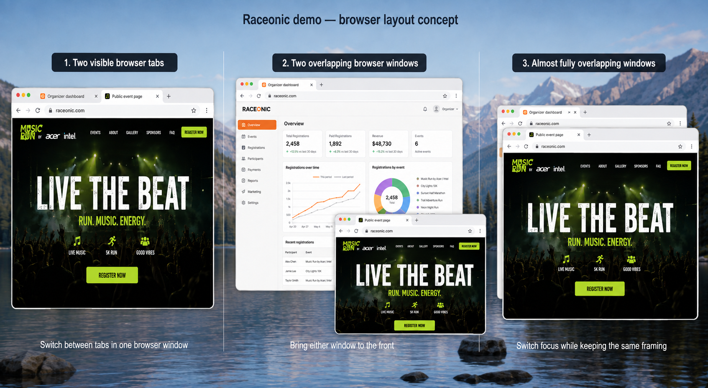

# Smooth Demo

Create product demo videos from the **actual app UI**, with gradual scrolling, an eased cursor, restrained zooms, wallpaper framing, and explanatory subtitles below the app.

This repository packages the `smooth-demo` skill for Codex and Claude Code. It includes recording guidance, capture and rendering helpers, a review checklist, and three browser-window layouts. It is an agent workflow, not a standalone screen recorder or a hosted video service.

## Install

### Claude Code

Add this repository as a marketplace and install the plugin:

```text
/plugin marketplace add RolandOne/smooth-demo
/plugin install smooth-demo@smooth-demo-marketplace
```

Reload plugins or start a new session after installation. The plugin supplies the skill and its helpers; it does not install browser/computer-use tools or grant access to an application.

### Codex: local skill

Clone the repository and link its skill into your personal skills directory:

```sh
git clone https://github.com/RolandOne/smooth-demo.git ~/plugins/smooth-demo
mkdir -p "${CODEX_HOME:-$HOME/.codex}/skills"
ln -s "$HOME/plugins/smooth-demo/skills/smooth-demo" "${CODEX_HOME:-$HOME/.codex}/skills/smooth-demo"
```

If that destination already exists, keep a backup or move the existing installation before creating the link. The command intentionally does not overwrite it. Start a new Codex task after installation, then invoke `$smooth-demo`.

The repository also includes a `.codex-plugin/plugin.json` manifest for Codex plugin packaging. The symlink method above installs only the skill and requires no marketplace registration.

## Requirements

- An agent with access to a compatible browser or computer-use tool and the target application.
- A recorder appropriate to the requested view: tab capture for page content, window/desktop-region capture for visible browser tabs or overlapping windows.
- Python 3 with Pillow, plus FFmpeg and FFprobe on `PATH` for rendering.
- Node.js for the CDP capture helper and its tests. The helper consumes a host-provided `cdp.send` / `cdp.readEvents` interface; it does not launch or connect to a browser by itself.
- A usable system font: the renderer tries macOS SFNS, then DejaVu Sans for captions.

Install the Python dependency in a virtual environment:

```sh
python3 -m venv .venv
. .venv/bin/activate
python -m pip install -r requirements.txt
```

Browser APIs and capture capabilities differ by agent host. A Claude Code installation does not automatically provide the Codex desktop browser API. Use an available equivalent recorder and preserve the timed action markers needed for motion rendering.

## Usage

```text
Use $smooth-demo to record a 45-second walkthrough of this app using demo data.

Use $smooth-demo to show the organizer dashboard and public event page
in two visible browser tabs, then switch back to the dashboard.

Use $smooth-demo to show the organizer and attendee views in two
partially overlapping browser windows. Bring each window forward.

Use $smooth-demo to compare before and after in almost fully overlapping
windows, keeping the viewport and scroll position consistent.

Use $smooth-demo to show this page on desktop and at 390×844.
Label the mobile viewport emulation and scroll gradually in both views.
```

In Claude Code, ask to use the Smooth Demo skill with the same brief.

By default, the output is silent with timed explanatory subtitles. Voiceover is opt-in; the workflow defaults to Marin when speech is requested and requires disclosure of OpenAI API credentials and usage charges before generation.

## Three browser layouts



*AI-generated composition mockup. The illustration is not a live recording, a product specification, or verified application data.*

| Layout | Use it for |
|---|---|
| **Two visible browser tabs** | Related pages that each need the full window: dashboard → public page → dashboard. |
| **Partially overlapping windows** | Connected views: organizer → attendee preview, or desktop + mobile. |
| **Almost fully overlapping windows** | Before/after comparisons, user roles, or versions at consistent scale and position. |

The requested tabs and overlap must appear in the finished video. Cuts between page-only recordings do not demonstrate a browser tab switch. When both views must remain readable at once, use side-by-side windows instead.

The bundled renderer styles one source canvas at a time. It does **not** manage native browser windows, generate a real tab strip, or automatically compose multiple windows. Capture the required arrangement with a compatible recorder; explicitly requested compositing must be disclosed.

## Workflow and quality checks

1. Define the outcome and write a shot list using observed app controls.
2. Prepare the correct environment, data, viewport, and capture method.
3. Record a short motion preview before the full take.
4. Capture real actions with timestamps; preserve gradual scrolling in the source.
5. Render the cursor, camera, wallpaper, and subtitles.
6. Review scrolls and transitions at normal speed, then check playback, seeking, dimensions, and full decoding.

A 60 fps export cannot repair choppy source footage. Post-production cursor smoothing does not smooth a page that was captured jumping instantly. Legitimate empty states may be demonstrated when explained.

Start with [SKILL.md](skills/smooth-demo/SKILL.md). Detailed guides:

- [Capture and motion](skills/smooth-demo/references/cinematic-motion.md)
- [Window layouts and scenario tests](skills/smooth-demo/references/scenario-review.md)
- [Recording workflow](skills/smooth-demo/references/workflow.md)
- [Narration and executive walkthroughs](skills/smooth-demo/references/executive-narration.md)

## Helper scripts

| Script | Purpose |
|---|---|
| `capture-cdp.mjs` | Capture a supported tab's screencast, check dimensions, and save recovery metadata. |
| `join-captures.py` | Join completed chapter manifests while preserving action offsets. |
| `plan-motion.py` | Suggest an editable cursor and camera timeline from action markers. |
| `render-motion.py` | Render real captures or video with framing, cursor motion, zooms, and subtitles. |

Run from the repository root after preparing a capture manifest:

```sh
python skills/smooth-demo/scripts/plan-motion.py /path/to/capture.json /path/to/motion.json --label "App demo"
python skills/smooth-demo/scripts/render-motion.py /path/to/motion.json --preview
python skills/smooth-demo/scripts/render-motion.py /path/to/motion.json
```

Review and adjust the generated timeline, including subtitles and camera timing, before the final render. See the motion guide for the configuration format and capture integration example.

## Tests

```sh
node --test skills/smooth-demo/scripts/tests/capture.test.mjs
python skills/smooth-demo/scripts/tests/motion_test.py
```

GitHub Actions runs these checks on pushes and pull requests. They cover helper behavior such as capture interruption, viewport rejection, cursor endpoints, and camera planning. They do not establish visual smoothness or prove that a particular host can record multiple windows; those require the scenario review and real playback.

No live recordings, login credentials, or private production datasets are included. Keep generated artifacts outside the tracked skill source.

## License

The code and documentation are MIT licensed; see [LICENSE](LICENSE). Bundled Apple and Microsoft wallpaper artwork is third-party material and is **not** covered by that MIT grant. Sources and attribution are documented in [wallpaper-sources.md](skills/smooth-demo/references/wallpaper-sources.md). A custom background or the generated gradient can be selected in the renderer.
